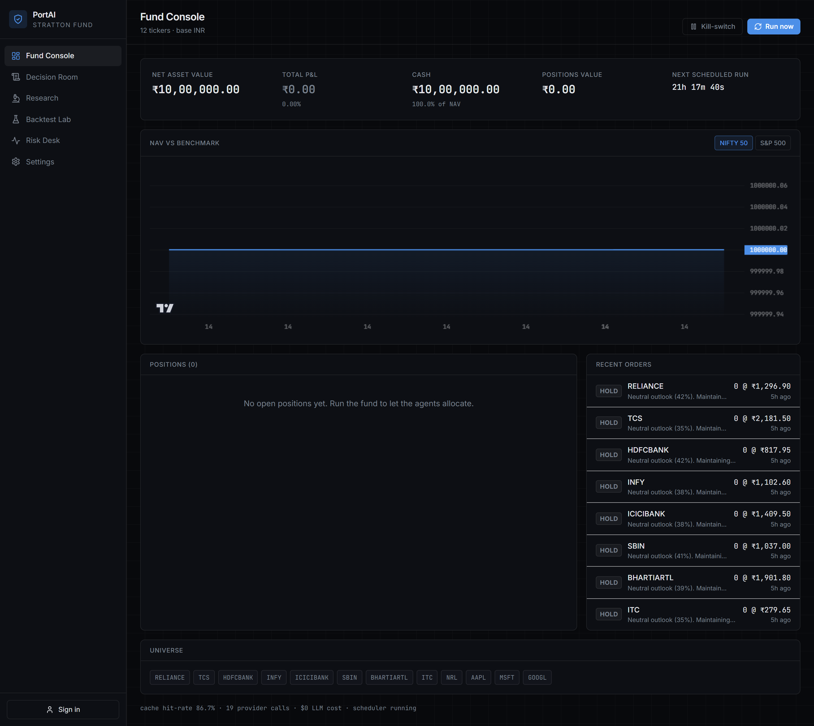
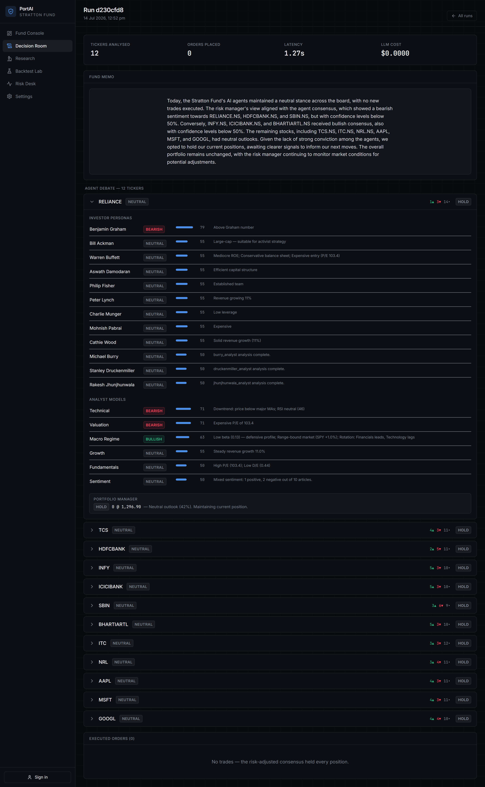
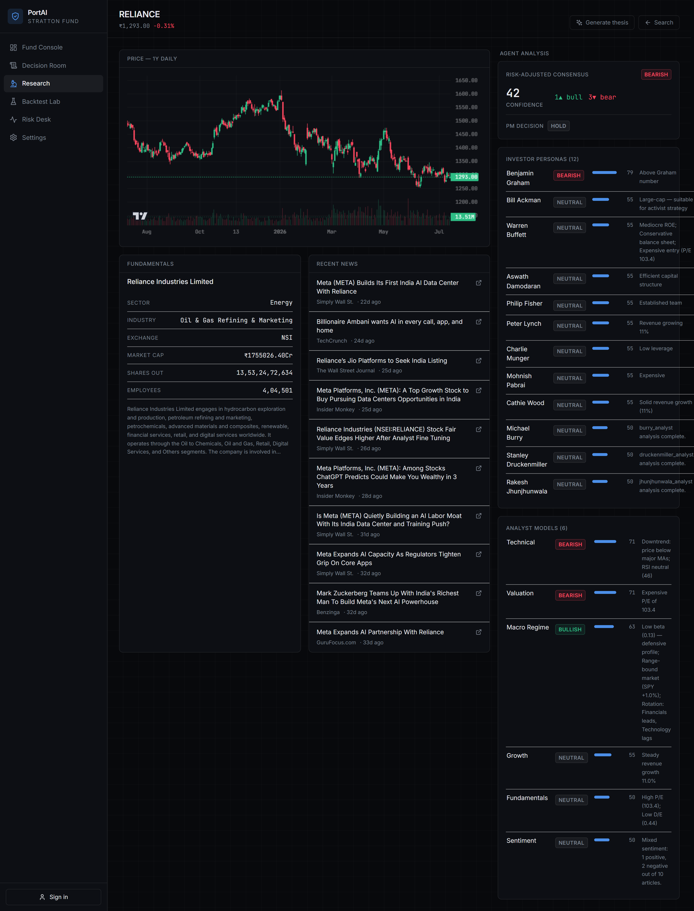
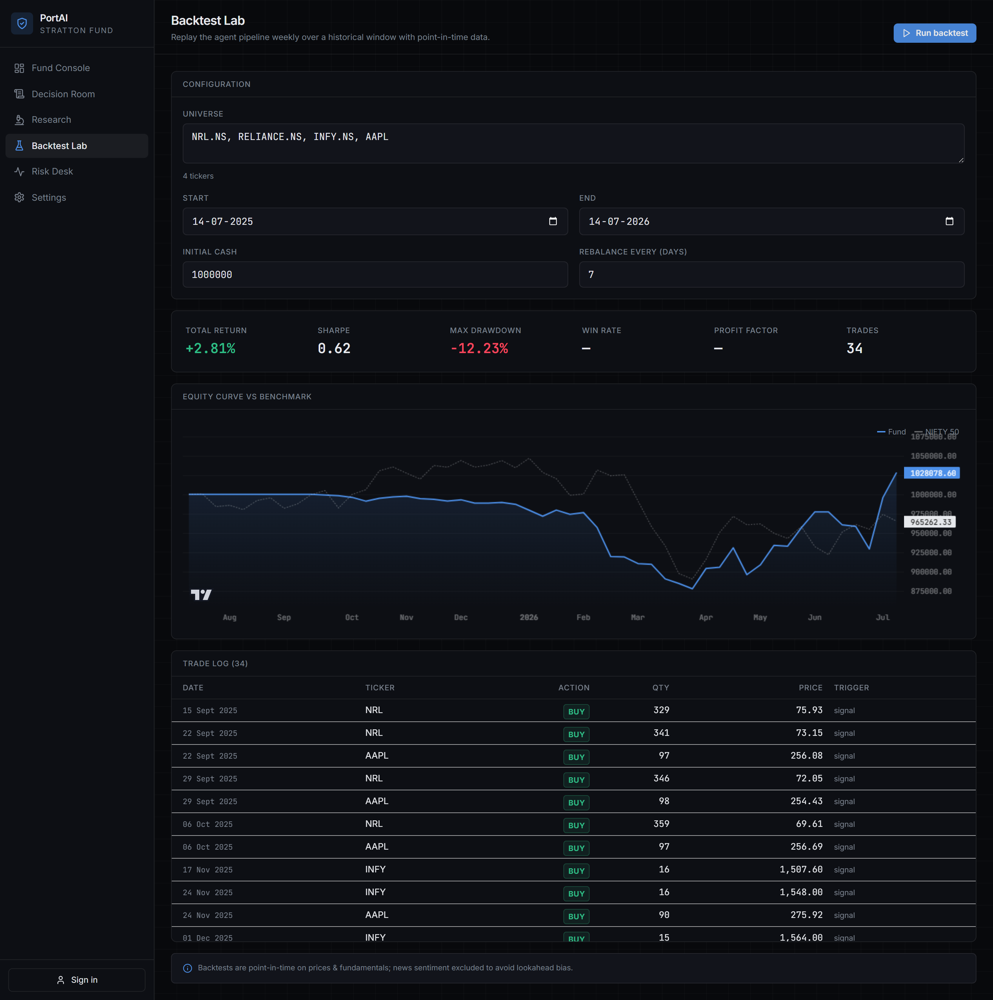
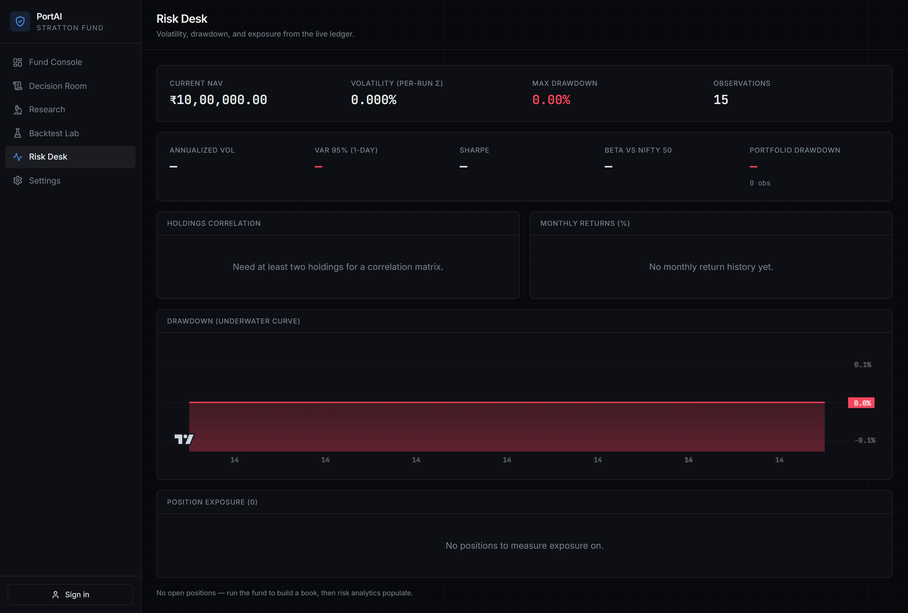
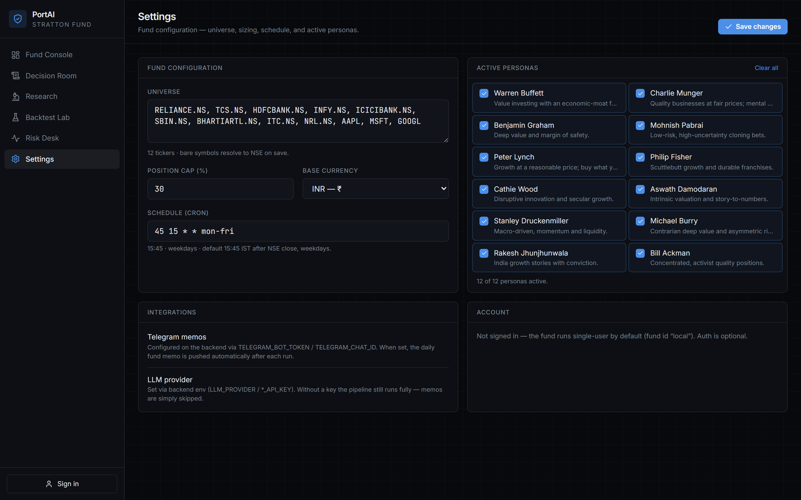

# PortAI — the Stratton Fund

An **AI-native paper hedge fund**. A team of deterministic agents autonomously
research, debate, risk-manage, and paper-trade a real portfolio on a schedule —
and every decision is fully auditable.

- **Real data everywhere.** Live NSE/US prices, fundamentals, and news via a
  cached market-data layer. No mock data anywhere in the shipped app.
- **Deterministic brain, optional LLM.** 6 analyst models + 12 investor personas
  score the universe with rule-based logic. The one LLM call per run writes a
  plain-English memo — and the whole pipeline runs fine without any LLM key.
- **Auditable.** Every run persists each agent's signal, the risk verdict, the
  orders applied, and the memo. The Decision Room reads straight from that store.
- **Fast.** A read-through cache with singleflight collapses a full-universe
  analysis to **0 provider calls when warm** (see [Benchmarks](docs/BENCHMARKS.md)).

> Paper trading only — no real money, no orders to a broker. Not financial advice.

---

## The six surfaces

The entire product is exactly six pages, each fully wired to real data.

| # | Surface | Route | What it does |
|---|---------|-------|--------------|
| 1 | **Fund Console** | `/` | NAV vs benchmark (NIFTY 50 / S&P 500), live positions & P&L, cash, recent orders, next-run countdown, kill-switch, run-now. |
| 2 | **Decision Room** | `/decisions`, `/decisions/[runId]` | The audit trail: every run, the per-ticker agent debate (personas vs analysts, direction, confidence, factors), the PM's orders, and the AI memo as a letter. |
| 3 | **Research Terminal** | `/research`, `/research/[ticker]` | On-demand deep-dive: candlestick chart, fundamentals, news, and a live pipeline run with an optional AI thesis. |
| 4 | **Backtest Lab** | `/backtest` | Point-in-time backtest over a historical window — equity curve vs benchmark, metrics, and a trade log. |
| 5 | **Risk Desk** | `/risk` | VaR, volatility, beta, Sharpe, drawdown, a holdings correlation heatmap, and a monthly-returns heatmap — from cached OHLCV. |
| 6 | **Settings** | `/settings` | Fund config: universe, position cap, schedule, base currency, and the 12 persona toggles. |

### Screenshots

**Fund Console** — NAV vs benchmark, positions with live P&L, cash, and the recent-orders feed.



**Decision Room** — the audit trail for a single run: the AI-written memo, then the per-ticker agent debate (all 12 personas + 6 analyst models with confidence bars and factors) and the PM's verdict.



**Research Terminal** — an on-demand deep-dive on any ticker: candlestick chart, fundamentals, recent news, and the full agent analysis.



**Backtest Lab** — the agent pipeline replayed weekly over a historical window. This 1-year run (NRL.NS · RELIANCE.NS · INFY.NS · AAPL) executed 34 agent-driven trades for +2.81% vs NIFTY 50 through a −12.23% max drawdown. Longer windows show sells and losses too — the trades are emergent from real signals, never seeded.



**Risk Desk** — VaR, volatility, beta, drawdown, and correlation from the live ledger. It populates once the fund holds positions (below, the empty state on a fresh fund).



**Settings** — fund config (universe, position cap, schedule, currency) and the 12 persona toggles.



## The core loop

On a schedule (default: weekdays 15:45 IST, after NSE close) the fund runs itself:

```
prefetch (through cache) → analysts + personas score in parallel
   → risk manager aggregates → portfolio manager emits orders
   → orders fill against the paper ledger → NAV snapshot
   → one LLM call writes the memo → run + signals + orders persisted
   → memo pushed to Telegram (if configured)
```

A human can trigger a run, pause the fund (kill-switch), or change the universe —
but the fund runs on its own.

## Architecture

```
 Next.js 14 (App Router)                 FastAPI (app factory, ~49 lines)
 ────────────────────────                ────────────────────────────────
 6 surfaces · react-query        HTTP    /api/v1/{market,fund,decisions,
 lightweight-charts · Tailwind  ───────▶  research,risk,backtest,meta}
 Supabase auth (optional)                          │
                                                   ▼
                              engine/            data/ (read-through cache)
                              ├─ pipeline (asyncio)   ├─ providers/ (yfinance)
                              ├─ analysts × 6         ├─ cache.py (TTL+singleflight)
                              ├─ personas (YAML×12)   └─ models.py (SQLite)
                              ├─ risk_manager             │
                              ├─ portfolio_manager        ▼
                              └─ synthesis (1 LLM)   fund/ (ledger, nav, scheduler,
                              risk/ · backtest/       service) · APScheduler
```

- **Backend:** FastAPI · SQLAlchemy (async, SQLite by default) · APScheduler ·
  yfinance · pydantic. One LLM call per run via the provider factory (Groq default;
  OpenAI/Anthropic/Google/DeepSeek supported). No LangGraph ([ADR-001](backend/docs/adr/001-remove-langgraph.md)).
- **Frontend:** Next.js 14, React 18, `@tanstack/react-query`, `lightweight-charts`,
  Tailwind, Supabase auth. Dark, dense, terminal-style; tabular numerals; green/red
  reserved for P&L.
- **Decisions:** see `backend/docs/adr/` (001 langgraph, 002 cache, 003 persona
  engine, 004 fund loop, 005 backtest, 006 risk, 007 directional-conviction
  aggregation).

## Getting started

Prereqs: Python 3.11+, Node 18+. Everything runs **without any API key** (the
memo is simply skipped).

```bash
# 1. backend
cd backend
python -m venv .venv && . .venv/bin/activate      # Windows: .venv\Scripts\activate
pip install -r requirements.txt
cp .env.example .env                               # optional: add GROQ_API_KEY etc.
uvicorn app.main:app --reload                      # http://localhost:8000

# 2. frontend (new terminal)
cd frontend
npm install
cp .env.example .env.local
npm run dev                                        # http://localhost:3000
```

Or with Docker: `cp .env.example .env && docker compose up --build`.
Or with Make: `make setup && make backend` (then `make frontend`).

Then open `http://localhost:3000`, and hit **Run now** on the Fund Console to
produce the first run — it appears in the Decision Room with signals, orders, a
NAV snapshot, and (with an LLM key) a memo.

## Testing & benchmarks

```bash
cd backend && python -m pytest -q      # backend suite
cd frontend && npm run build           # strict type-check + production build
cd backend && python scripts/bench.py  # cold vs warm efficiency (offline)
```

Measured efficiency and the deltas vs the Phase-0 baseline are in
[`docs/BENCHMARKS.md`](docs/BENCHMARKS.md); the before/after reconciliation is in
[`docs/BASELINE.md`](docs/BASELINE.md).

## Configuration

All backend settings are env vars (`backend/app/config.py`); see
`backend/.env.example`. Common ones:

- `GROQ_API_KEY` (or `OPENAI_API_KEY` / `ANTHROPIC_API_KEY` / …) — enables the memo.
- `TELEGRAM_BOT_TOKEN` + `TELEGRAM_CHAT_ID` — pushes the memo after each run.
- `DATABASE_URL` — defaults to local SQLite.
- `NEXT_PUBLIC_API_URL` (frontend) — the backend origin, inlined at build time.

## Project layout

```
backend/app/  api/v1 · config · data (providers, cache, models) · engine
              (pipeline, analysts, personas, risk_manager, portfolio_manager,
              synthesis) · fund (ledger, nav, scheduler, service) · risk · backtest
frontend/     app/ (6 surfaces) · components · lib (api client, hooks, types)
docs/         BASELINE.md · BENCHMARKS.md · LATER.md      backend/docs/adr/
```

Deferred ideas live in [`docs/LATER.md`](docs/LATER.md) — the product stays six
surfaces. The transformation brief is [`TRANSFORM.md`](TRANSFORM.md).

## License

MIT — see [LICENSE](LICENSE).
